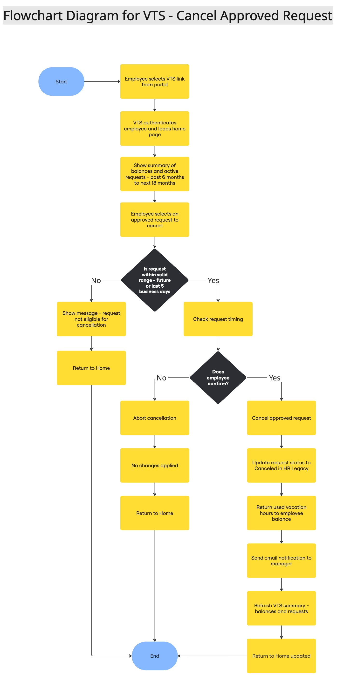
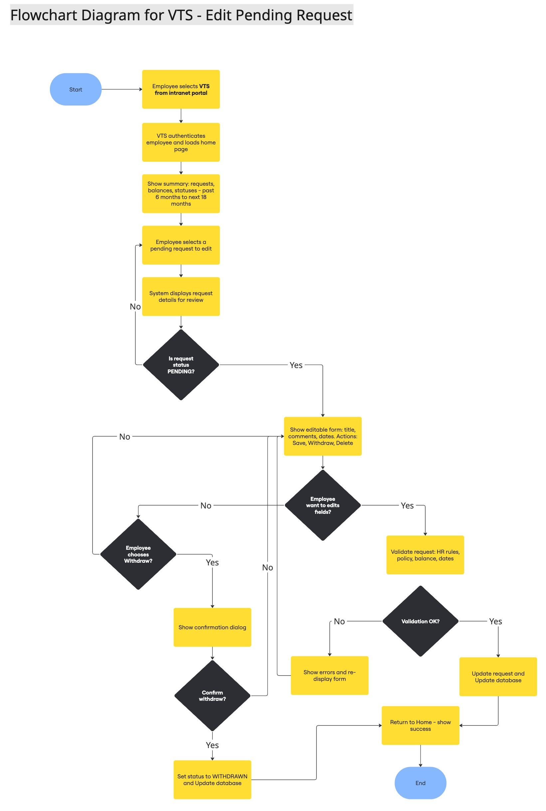

# 🌴 Vacation Tracking System (VTS)

A centralized internal system for managing employee vacation requests, approvals, balances, and HR workflows.

---

## 🧭 Vision (Consolidated)

- Improve internal business processes by reducing the time needed to manage vacation time requests.
- Empower employees to manage their own vacation, sick, and personal leave without deep policy knowledge.
- Primary design goal: the system must be **easy to use**, **intuitive**, and **intelligent**.

---

## 🧠 Problem Domain

Centered around the management of employee vacation time, sick leave, and personal time off within an organization.

---

# 🧩 Use Case 1 — Manage Time

This use case focuses on enabling employees to submit, track, and manage vacation or leave requests, while allowing managers to review and approve them.

---

## ⚙️ Functional Requirements (Merged)

1. **Rules-based validation engine** for leave requests (policy limits, balances, blackout periods, tenure rules, etc.).
2. **Optional manager approval** depending on role/level; some senior roles may bypass approval.
3. **Notifications** via email (and portal inbox if available) to employees and managers on submit/approve/reject/cancel.
4. **Single Sign-On** (SSO) via the organization’s portal; use the portal’s user context for all authentication.
5. **Activity logs** for all transactions (auditable: who, what, when, before/after values, IP/device).
6. **HR & System Administration overrides** with full audit tracking (amend, grant, revoke, correct balances).
7. **Managers can directly grant personal/comp time** within configured limits.
8. **Integration services** with legacy HR/Payroll/Directory to sync employees, calendars, and balances.
9. **Vacation timeline access window:** view prior year records and plan up to **1.5 years ahead**.
10. **Self-service dashboard** for employees (submit, track, cancel) and managers (review queues, filters, bulk actions).
11. **Internal API** for querying summaries (e.g., per-employee/year, team calendar, remaining balances).
12. **Balance lookup** on request creation and after status changes to ensure consistency.

---

## 🧩 Non-Functional Requirements (Merged)

- **Usability:** UI must be simple, clear, and employee-friendly (primary design goal).
- **Performance:** Core operations (submit, approve, fetch balances) should complete within acceptable SLAs (e.g., P95 < 1s for reads, < 2s for writes where feasible).
- **Scalability:** Support organization-wide usage (concurrent users, seasonal peaks) without degradation.
- **Reliability & Consistency:** Accurate balances and idempotent operations; safe retries.
- **Security:** SSO + RBAC; least privilege; sensitive fields masked; audit immutability.
- **Maintainability:** Clean, modular architecture; testable services; configuration-driven rules.
- **Auditability:** End-to-end trace of every state change.
- **Observability:** Metrics, logs, and alerts (errors, latency, queue depth).

---

## ⛔ Constraints (Merged)

1. **Web application** within the existing **Intranet Portal**.
2. Must **reuse existing hardware and middleware**.
3. Must use **existing SSO** for authentication.
4. Respect **legacy integrations** (HR/Payroll) and their data contracts.
5. **HR** remains the source of truth for policy and employee master data.

---

## 🎭 System Actors

- **Employee** — submit/track/cancel leave; view balances.
- **Manager** — review/approve/reject; grant comp/personal leave within limits.
- **HR Clerk** — manage policies/records; override decisions.
- **System Administrator** — configure, maintain uptime, logs, backups.
- **Email Service** — delivers notifications.

---

## 📊 System Diagrams

### 1) Employee Flowchart

### 2) Manager Flowchart

---

## 🔁 Sequence Diagrams (Split)

### A) Employee — Manage Time (Submit Leave Request)

### B) Manager — Review & Decision

---

# 🧩 Use Case 2 — Cancel Approved Request

This use case describes the process in which an **employee cancels a previously approved vacation time request** that is either scheduled for a future date or within the recent past (last 5 business days).

---

## 🎯 Goal

Allow employees to **cancel an approved vacation request**, ensuring:

- Updated balances are immediately reflected.
- Managers are notified of the cancellation.
- HR records remain synchronized and auditable.

---

## ⚙️ Preconditions

1. The employee has an **approved** vacation request.
2. The request is scheduled in the **future** or within the **past 5 business days**.
3. The employee is **authenticated via SSO** and authorized to use the VTS system.

---

## 🧩 Main Flow

1. The **employee** navigates to the VTS home page through the intranet portal.
2. The **portal (SSO)** authenticates the employee and opens VTS with the user context.
3. The **VTS Web** displays:
   - A summary of vacation requests (past 6 months → next 18 months).
   - Outstanding balances per vacation type.
4. The **employee** selects an approved request (future or recent past) to cancel.
5. The **VTS Web** retrieves details of the request and checks eligibility:
   - Must be “Approved” status.
   - Must be within the valid time range.
6. The employee is prompted for confirmation:
   - **If future:** Confirm cancellation.
   - **If recent past:** Confirm cancellation **and** provide a short explanation.
7. If confirmed:
   - **VTS Web → HR Legacy:** Update request status to **Canceled**.
   - Return used hours to the employee’s balance.
   - **VTS Web → Email Service:** Send a cancellation notification to the manager.
8. **VTS Web** refreshes the summary and returns the employee to the home screen.
9. If the employee aborts, **no changes** occur.

---

## 🔄 Alternate Flow — Employee Aborts Cancellation

1. The employee clicks **Cancel** on the confirmation dialog.
2. No data is changed.
3. The employee is returned to the home screen.

---

## 📬 Postconditions

- Request status is **Updated → Canceled**.
- **Balance** is **recalculated** and displayed correctly.
- **Manager** receives an **email notification**.
- All actions are recorded in **audit logs**.

---

## 📈 System Interaction Summary

| Actor         | Action                | Outcome                            |
| ------------- | --------------------- | ---------------------------------- |
| Employee      | Confirms cancellation | Request canceled; balance restored |
| Employee      | Aborts                | No change                          |
| HR Legacy     | Updates record        | State changed to **Canceled**      |
| Email Service | Sends notification    | Manager informed of cancellation   |

---

## 🧭 Flowchart — Cancel Approved Request

---

## 🔁 Sequence Diagram — Cancel Approved Request

---

# 🧩 Use Case 3 — Edit Pending Request

This use case describes the process in which an **employee edits a pending vacation request** before it is approved or denied by the manager.

---

## 🎯 Goal

Allow employees to **modify details of a pending vacation request**, such as:
- The **title**, **description/comments**, or **dates** of the request.  
- Optionally, the employee may **withdraw or delete** the request entirely.

---

## ⚙️ Preconditions

1. The employee has a **pending vacation request** that has **not yet been approved or rejected**.  
2. The employee is **authenticated via SSO** and authorized to access the **VTS Web Application**.  
3. The employee navigates through the **intranet portal**, which provides the proper access context.

---

## 🧩 Main Flow

1. The **employee** opens the VTS home page via the intranet portal.  
2. The **portal (SSO)** authenticates the employee and opens the VTS with user privileges.  
3. The **VTS Web** displays:
   - A **summary** of all vacation requests (past 6 months → next 18 months).  
   - The **balances** per category and **statuses** of active requests.  
4. The **employee** selects a vacation request in **Pending** status to edit.  
5. The **VTS Web** displays an **editable form** for that request, allowing:  
   - Changing the **title**, **comments**, or **dates**.  
   - Option to **withdraw** or **delete** the request.  
6. The **employee** performs one of the following actions:  
   - **Edits** the information and clicks **Save**.  
   - **Withdraws** the request.  
   - **Deletes** the request (optional).  
7. If the employee clicks **Save**, the system:  
   - Validates the modified information against HR policies and balance limits.  
   - If validation succeeds → updates the request and returns to the home page.  
   - If validation fails → redisplays the edit page and highlights all errors.  
8. If the employee clicks **Withdraw**, the system:  
   - Prompts for confirmation.  
   - Upon confirmation → sets the request status to **Withdrawn**, updates the database, and returns to the home page.  
9. If the employee clicks **Delete**, the system:  
   - Prompts for confirmation.  
   - Upon confirmation → permanently removes the request and returns to the home page.

---

## 🔄 Alternate Flow — Employee Cancels Editing

1. The employee exits the edit page or clicks **Cancel**.  
2. No data is changed.  
3. The employee is redirected back to the VTS home page.

---

## 📬 Postconditions

- If **changes** are saved → the **request is updated** with new information.  
- If **withdrawn** → the **status changes** to **Withdrawn**.  
- If **deleted** → the **request is permanently removed**.  
- All actions are **logged in the audit trail** with timestamps and user identifiers.

---

## 📈 System Interaction Summary

| Actor         | Action             | Outcome                                   |
| --------------| ------------------ | ----------------------------------------- |
| Employee      | Edits & saves      | Request updated successfully              |
| Employee      | Withdraws request  | Status changed to **Withdrawn**           |
| Employee      | Deletes request    | Request deleted permanently               |
| VTS Web       | Validates changes  | Errors displayed or data saved            |
| HR Legacy     | Syncs records      | Updated info reflected in HR system       |

---

## 🧭 Flowchart — Edit Pending Request

---

## 🔁 Sequence Diagram — Edit Pending Request

---
