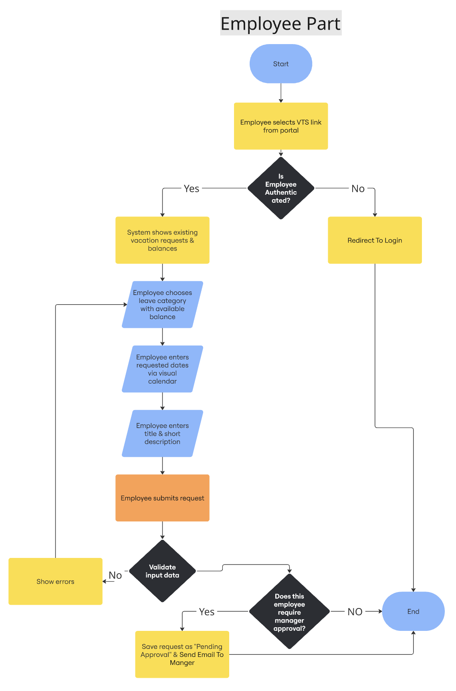
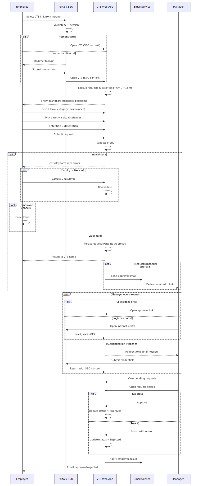

# 🌴 Vacation Tracking System (VTS)

A centralized internal system for managing employee vacation requests, approvals, balances, and HR workflows.

## 🧭 Vision
The Vacation Tracking System (VTS) aims to provide employees with the ability to manage their own vacation, sick, and personal leave time **without needing deep knowledge of company policies**.

### 🎯 Objectives
- Empower employees to manage their leave independently.
- Streamline HR department operations.
- Reduce administrative overhead on management.
- Accelerate approval workflows and response times.
- Improve employee experience and satisfaction.

> **Primary Design Goal:**  
> The system must be **easy to use**, **intuitive**, and **intelligent**.

---

## ⚙️ Functional Requirements
1. Implement a flexible **rules-based engine** for validating leave requests.
2. Support **optional manager approval** depending on employee role and level.
3. Allow access to vacation records from the **previous year** and up to **1.5 years ahead**.
4. Send **email notifications** for approvals and status changes.
5. Integrate with the **Intranet Portal** and support **Single Sign-On**.
6. Maintain **activity logs** for all actions.
7. Allow **HR / Admins** to override actions with full audit tracking.
8. Managers can **grant personal leave directly** within rule limits.
9. Provide an **internal API** for querying vacation summaries.
10. Integrate with **legacy HR systems** to sync employee and leave data.

---

## 🧩 Non-Functional Requirements
| Requirement        | Description |
|-------------------|-------------|
| Ease of Use       | UI must be simple, clear, and employee-friendly. |
| Scalability       | Supports many users with no performance loss. |
| Performance       | Core requests must respond quickly. |
| Reliability       | Consistent state and accurate transactions. |
| Security          | SSO + Role-Based Access Control. |
| Integration       | Works smoothly with current HR systems and intranet. |
| Maintainability   | Clean, extendable architecture. |
| Auditability      | Complete traceability of every action. |

---

## ⛔ Constraints
1. The system must be a **web application** (not desktop).
2. Must **extend the existing Intranet Portal**.
3. Must **reuse current hardware and middleware**.
4. Must use **existing Single Sign-On** for authentication.
5. HR is responsible for updating employee leave records.
6. Certain senior roles may **skip manager approval**.

---

## 💭 Assumptions
1. All employees have active intranet accounts.
2. HR maintains centralized employee and leave policy data.
3. Email delivery is available via the internal mail server.
4. Managers and staff are familiar with company tools.
5. Leave rules are predefined and available.
6. Legacy HR systems provide API/DB integration points.
7. Network stability within intranet is reliable.
8. The organization has full control of its infrastructure.

---

## 🎭 System Actors

| Actor               | Responsibilities |
|---------------------|-----------------|
| **Employee**        | Submit / track / cancel leave requests; view balances. |
| **Manager**         | Approve / reject requests; grant compensatory leave. |
| **HR Clerk**        | Manage policies, records, and override decisions. |
| **System Administrator** | Maintain uptime, logs, backups, and config. |
| **Email Service**   | Sends notification messages to employees & managers. |

---

## 🏛️ High-Level Flow (Summary)
1. Employee submits leave request.
2. System validates request using business rules.
3. If required → Manager approves/denies.
4. Request status is updated & notifications are sent.
5. HR updates master leave records when needed.

---

## 📊 System Diagrams

### 1) Employee Flowchart

### 2) Manager Flowchart

### 3) Sequence Diagram

